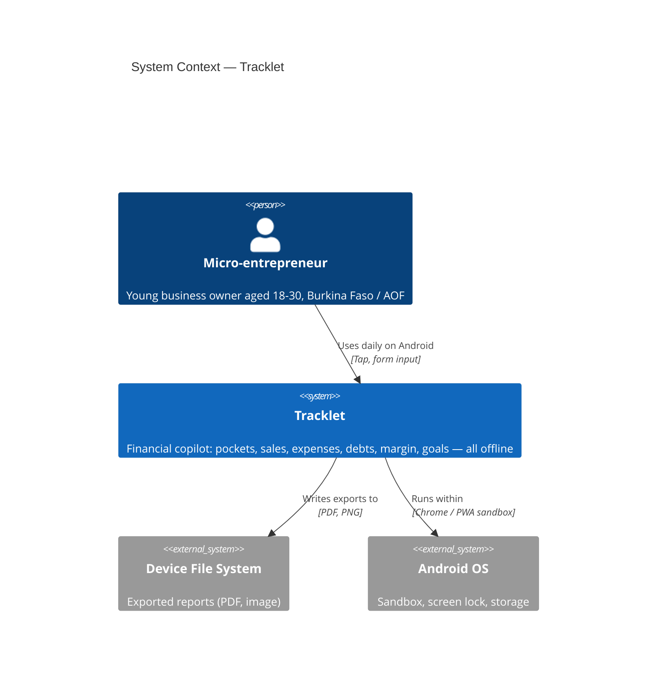

# C4 Context Diagram — Tracklet

## Description

Tracklet has no backend, no API, no cloud, and no network dependencies.
The entire system is the PWA running on the user's Android device.
External systems are limited to the device OS and file system for exports.
