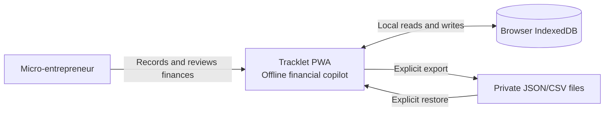

# C4 Level 1 — Context

```mermaid
flowchart LR
  user[Micro-entrepreneur]
  tracklet[Tracklet PWA\nOffline financial copilot]
  idb[(Browser IndexedDB)]
  files[Private JSON/CSV files]

  user -->|Records and reviews finances| tracklet
  tracklet <--> |Local reads and writes| idb
  tracklet -->|Explicit export| files
  files -->|Explicit restore| tracklet
```

There is no backend or external financial-data service in alpha 0.2.0.
