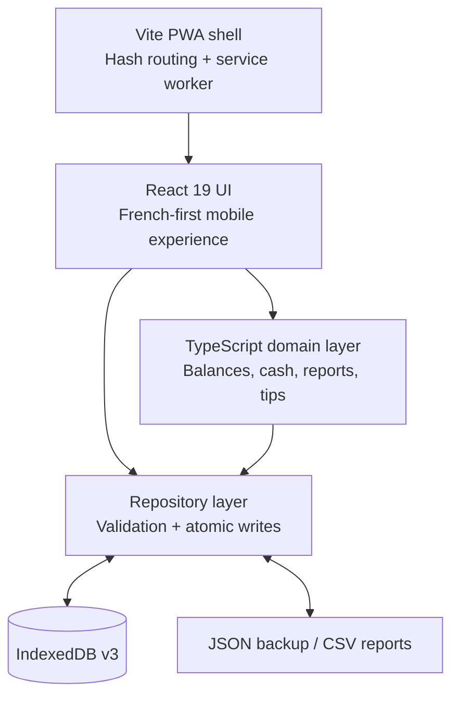

# C4 Level 2 — Containers

```mermaid
flowchart TB
  ui[React 19 UI\nFrench-first mobile experience]
  shell[Vite PWA shell\nHash routing + service worker]
  domain[TypeScript domain layer\nBalances, cash, reports, tips]
  repos[Repository layer\nValidation + atomic writes]
  idb[(IndexedDB v3)]
  files[JSON backup / CSV reports]

  shell --> ui
  ui --> domain
  ui --> repos
  domain --> repos
  repos <--> idb
  repos <--> files
```
