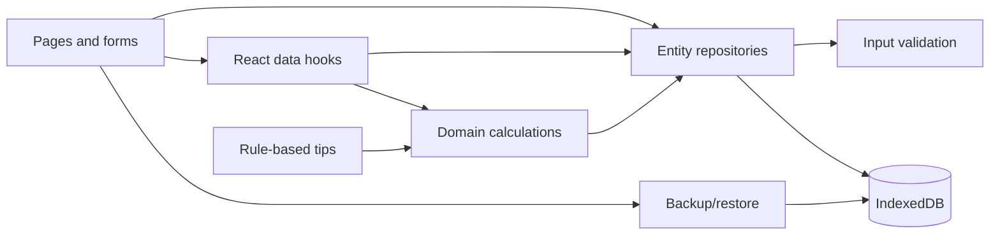

# C4 Level 3 — Components

```mermaid
flowchart LR
  pages[Pages and forms]
  hooks[React data hooks]
  calcs[Domain calculations]
  tips[Rule-based tips]
  backup[Backup/restore]
  repositories[Entity repositories]
  validation[Input validation]
  db[(IndexedDB)]

  pages --> hooks
  pages --> backup
  pages --> repositories
  hooks --> calcs
  hooks --> repositories
  calcs --> repositories
  tips --> calcs
  repositories --> validation
  repositories --> db
  backup --> db
```

High-risk multi-store operations—transfers, sales, and restore—use a single IndexedDB transaction.
