# C4 Component Diagram — Tracklet

```mermaid
C4Component
  title Component Diagram — Web Application (React)

  Person(micro_entrepreneur, "Micro-entrepreneur", "Android user")

  System_Boundary(presentation, "Presentation Layer") {
    Component(balance_card, "BalanceCard", "React", "Hero balance display per realm")
    Component(realm_tabs, "RealmTabs", "React", "Perso/Business switcher")
    Component(pocket_grid, "PocketCardGrid", "React", "3-column pocket cards")
    Component(quick_actions, "QuickActions", "React", "Income/Expense/Transfer/Debt buttons")
    Component(insight_card, "InsightCard", "React", "Contextual learning banner")
    Component(forms, "Forms", "React", "TransactionForm, SaleForm, ExpenseForm, DebtForm, GoalForm")
    Component(margin_view, "MarginView", "React", "Business margin breakdown")
    Component(cash_position, "CashPositionView", "React", "Available / committed / to receive")
    Component(report_view, "ReportView", "React", "Period selector + export")
    Component(bottom_nav, "BottomNav", "React", "5-tab navigation")
    Component(agent_view, "AgentView", "React", "Native Agent chat (premium, future)")
  }

  System_Boundary(logic, "Application Logic Layer") {
    Component(pocket_handler, "PocketHandlers", "TypeScript", "create, credit, debit, transfer")
    Component(sale_handler, "SaleHandlers", "TypeScript", "create, list, aggregate")
    Component(expense_handler, "ExpenseHandlers", "TypeScript", "create, list, aggregate")
    Component(debt_handler, "DebtHandlers", "TypeScript", "create, update status")
    Component(goal_handler, "GoalHandlers", "TypeScript", "create, progress query")
    Component(calc_balance, "BalanceCalculator", "TypeScript", "pocket / total / cash position")
    Component(calc_margin, "MarginCalculator", "TypeScript", "gross margin / net result")
    Component(insight_engine, "InsightEngine", "TypeScript", "rule-based dispatch + dedup")
    Component(report_gen, "ReportGenerator", "TypeScript", "PDF / image export")
  }

  System_Boundary(data, "Data Access Layer") {
    Component(pocket_repo, "PocketRepository", "TypeScript", "CRUD + balance query")
    Component(txn_repo, "TransactionRepository", "TypeScript", "ledger by pocket")
    Component(sale_repo, "SaleRepository", "TypeScript", "CRUD + period aggregation")
    Component(expense_repo, "ExpenseRepository", "TypeScript", "CRUD + category aggregation")
    Component(debt_repo, "DebtRepository", "TypeScript", "CRUD + status transitions")
    Component(goal_repo, "GoalRepository", "TypeScript", "CRUD + progress")
    Component(insight_repo, "InsightRepository", "TypeScript", "dismiss + session state")
  }

  System_Boundary(storage, "Storage") {
    ComponentDb(indexeddb, "IndexedDB", "Browser Storage", "All app data")
  }

  Rel(micro_entrepreneur, balance_card, "Reads balance from")
  Rel(micro_entrepreneur, realm_tabs, "Switches realm via")
  Rel(micro_entrepreneur, quick_actions, "Triggers action via")
  Rel(micro_entrepreneur, forms, "Fills and submits")

  Rel(pocket_grid, pocket_handler, "Credits/debits via")
  Rel(forms, sale_handler, "Submits sale via")
  Rel(forms, expense_handler, "Submits expense via")
  Rel(forms, debt_handler, "Records debt via")
  Rel(forms, goal_handler, "Creates goal via")

  Rel(quick_actions, pocket_handler, "Quick credit/debit")
  Rel(quick_actions, debt_handler, "Quick debt")

  Rel(pocket_handler, pocket_repo, "Writes to")
  Rel(sale_handler, sale_repo, "Writes to")
  Rel(expense_handler, expense_repo, "Writes to")
  Rel(debt_handler, debt_repo, "Writes to")
  Rel(goal_handler, goal_repo, "Writes to")

  Rel(pocket_repo, indexeddb, "Reads/writes")
  Rel(txn_repo, indexeddb, "Reads/writes")
  Rel(sale_repo, indexeddb, "Reads/writes")
  Rel(expense_repo, indexeddb, "Reads/writes")
  Rel(debt_repo, indexeddb, "Reads/writes")
  Rel(goal_repo, indexeddb, "Reads/writes")
  Rel(insight_repo, indexeddb, "Reads/writes")

  Rel(balance_card, calc_balance, "Queries balance from")
  Rel(margin_view, calc_margin, "Queries margin from")
  Rel(report_view, report_gen, "Triggers export")
  Rel(insight_card, insight_engine, "Requests insight")

  Rel(calc_balance, txn_repo, "Reads transactions")
  Rel(calc_margin, sale_repo, "Reads sales")
  Rel(calc_margin, expense_repo, "Reads expenses")
  Rel(report_gen, sale_repo, "Reads data from")
  Rel(report_gen, expense_repo, "Reads data from")
  Rel(insight_engine, insight_repo, "Checks seen insights")

  UpdateLayoutConfig($c4ShapeInRow="3", $c4BoundaryInRow="1")
```



## Component Interactions

### Write Flow (e.g., logging a sale)
```
QuickActions → SaleForm → SaleHandlers.create()
  → SaleRepository.create()
    → IndexedDB.add()
  ← confirmation
  → InsightEngine.dispatch("sale_created")
    → InsightCard shows learning
```

### Read Flow (e.g., viewing dashboard)
```
BalanceCard → BalanceCalculator.calculateTotalBalance()
  → TransactionRepository.getByPocket()
    → IndexedDB.getAll()
  ← sum computed
← rendered as "47 500 FCFA"
```

### Export Flow
```
ReportView (period selected) → ReportGenerator.generate()
  → SaleRepository.getByPeriod()
  → ExpenseRepository.getByPeriod()
  → render PDF/image
  → File System API write
← download notification
```
